<div align="center">

# 🌴 Chennai PG Intelligence

### End-to-end ML system that scrapes, cleans, models, and serves PG/hostel rent predictions for Chennai

*Went to Chennai for a job and got tired of guessing PG prices? This project fixes that.*

[](https://www.python.org/)
[](https://fastapi.tiangolo.com/)
[](https://streamlit.io/)
[](https://xgboost.readthedocs.io/)
[](https://optuna.org/)
[](https://mlflow.org/)
[](https://www.docker.com/)
[](https://azure.microsoft.com/en-us/products/container-apps)
[](https://github.com/astral-sh/uv)
[](https://github.com/DineshMSDian/chennai-pg-price-predictor/branches)
[](https://github.com/DineshMSDian/chennai-pg-price-predictor/commits/main)

### 🔗 [**Try the live app →**](https://chennai-pg-web.kindrock-91ecbb54.southindia.azurecontainerapps.io/)

*It's on a scale-to-zero Azure Container Apps plan, so the **first request can take ~2 minutes to cold-start** that's the container spinning back up, not a bug. Give it a minute and reload.*

</div>

---

## 📖 Table of Contents

- [Overview](#-overview)
- [Live Demo](#-live-demo)
- [Architecture](#-architecture)
- [Branching Strategy 9 Branches, 85 Commits](#-branching-strategy--9-branches-85-commits)
- [Repository Structure](#-repository-structure)
- [How the Pipeline Works](#-how-the-pipeline-works)
- [Deployment & Infrastructure](#-deployment--infrastructure)
- [Model Performance](#-model-performance)
- [Tech Stack](#-tech-stack)
- [Getting Started](#-getting-started)
- [API Reference](#-api-reference)
- [Coverage: Localities Scraped](#-coverage-localities-scraped)
- [Roadmap](#-roadmap)
- [Author](#-author)

---

## 🎯 Overview

**Chennai PG Intelligence** predicts a fair monthly rent for a PG/hostel in Chennai based on locality, gender preference, sharing type (occupancy), and amenities (food, wifi, laundry, AC, parking). It's built as a **full MLOps loop, not a notebook**: scraped data → tracked experiments → a versioned model artifact → two independently containerized services → a live cloud deployment. 85 commits and 9 working branches went into getting it there.

1. **Scrape** live PG listings from NoBroker across 8 Chennai micro-markets
2. **Clean & engineer** features with a custom `scikit-learn` pipeline
3. **Tune & train** an `XGBoost` regressor with `Optuna` (Bayesian search), tracked in `MLflow`
4. **Serve** predictions through a `FastAPI` backend, packaged as its own Docker image
5. **Present** them through a themed `Streamlit` web app (yes, it has a GTA Vice City skin 🌅), packaged as a *separate* Docker image
6. **Ship** both containers to **Azure Container Apps**, running as independent, scalable services

Given a locality + preferences, the system returns a predicted rent **and a realistic price band** (`lower`–`upper`) derived from the model's held-out test error, so it reads like "expect to pay ₹X, typically between ₹Y–₹Z" rather than a single overconfident number.

---

## 🌐 Live Demo

<div align="center">

### 👉 **[chennai-pg-web.kindrock-91ecbb54.southindia.azurecontainerapps.io](https://chennai-pg-web.kindrock-91ecbb54.southindia.azurecontainerapps.io/)** 👈

</div>

- The Streamlit frontend and the FastAPI backend each run as **separate Docker containers on Azure Container Apps**, in South India region.
- Both apps run on a **consumption plan that scales to zero** when idle great for cost, but it means the **first request after a period of inactivity takes ~2 minutes to cold-start** while the container image boots back up. Subsequent requests are fast.
- If the UI looks unresponsive on first load, that's the cold start, not a crash — refresh after ~2 minutes.

---

## 🏗 Architecture

```mermaid
flowchart LR
    subgraph Data["📥 Data Collection"]
        A[NoBroker.in API] -->|Scraper/scraper.py| B[(Data/raw/dataset.csv)]
    end

    subgraph Prep["🧹 Preprocessing (src/preprocess.py)"]
        B --> C[load_and_clean]
        C --> D[train/val/test split<br/>stratified on occupancy]
        D --> E[Custom Transformers:<br/>BasicFeatureTransformation<br/>LocalMedianImputation]
        E --> F[ColumnTransformer:<br/>Ordinal · OHE · Target Encoding]
    end

    subgraph Train["🎯 Training (src/train.py + optuna_tune.py)"]
        F --> G[Optuna: 100-trial<br/>Bayesian search]
        G --> H[Retrain XGBRegressor<br/>on train+val with best params]
        H --> I[Evaluate on held-out test set]
        I -->|MLflow tracking| J[(mlflow.db)]
        I --> K[models/full_pipeline.pkl<br/>models/locality_reference.pkl<br/>models/metrics.json]
    end

    subgraph Serve["🚀 Serving — two independent containers"]
        K --> L[Docker image: api<br/>FastAPI · /prediction · /get-localities]
        K --> M[Docker image: web<br/>Streamlit UI]
    end

    subgraph Deploy["☁️ Azure Container Apps — South India"]
        L --> N[api container app]
        M --> O[web container app]
        O -->|HTTPS| N
    end
```



---

## 🌳 Branching Strategy 9 Branches, 85 Commits

This wasn't built on a single `main` branch `main` is kept **stable and untouched during active work**: every feature (EDA, preprocessing, modeling, backend, frontend, Docker/Azure) is developed on its own branch and **merged in via pull request** once it's working, which is where most of those 85 commits live.

| Branch | Purpose |
|---|---|
| `main` | Stable, deployable state untouched directly; only updated via PR merges from other branches |
| `preprocessing` | Data cleaning, feature engineering, the custom `scikit-learn` transformers |
| `modeling` | XGBoost model iteration and evaluation |
| `feature/EDA` | Exploratory data analysis on the scraped dataset |
| `backend` | `FastAPI` service development (`api/`) merged via PR #4 |
| `frontend/streamlit` | `Streamlit` UI development (`web/`), including the GTA Vice City theme merged via PR #5 |
| `prod-pipeline` | Converts the exploratory notebook work (EDA/modeling) into clean, production-grade pipeline scripts the "notebook-to-script" refactor |
| `deploy/docker-azure` | Dockerizing the API and web services, Azure Container Apps deployment |
| `dev` | Integration branch for pulling feature work together ahead of `main` |

---

## 📂 Repository Structure

```
chennai-pg-price-predictor/
├── Scraper/
│   ├── config.py            # NoBroker API config, headers, base64-encoded area geo-params
│   └── scraper.py           # Paginated scraper → parses PG JSON into flat rows → CSV/JSON
│
├── src/
│   ├── configs.py           # Central config: paths, column groups, model constants
│   ├── preprocess.py        # Cleaning, splitting, custom transformers, ColumnTransformer
│   ├── optuna_tune.py       # Optuna objective + MLflow-tracked hyperparameter search
│   ├── train.py             # Full train orchestration (tune → retrain → eval → save)
│   └── predict.py           # Loads saved pipeline, runs single-record predictions (+ CLI demo)
│
├── api/
│   └── main.py               # FastAPI service health check, localities, prediction
│
├── web/
│   └── app.py                 # Streamlit UI (GTA Vice City–themed) that calls the API
│
├── models/
│   ├── full_pipeline.pkl      # preprocessor + trained XGBRegressor (joblib)
│   ├── locality_reference.pkl # per-locality median/mode feature lookup table
│   └── metrics.json           # test_mae / test_rmse / test_r2
│
├── Data/raw/                   # Scraped, gitignored raw dataset (created at runtime)
├── .gitignore
├── .python-version
├── pyproject.toml / uv.lock    # Dependency management (uv)
└── main.py                     # Placeholder entrypoint
```

---

## 🔄 How the Pipeline Works

### 1️⃣ Scraping — `Scraper/scraper.py`
- Hits NoBroker's internal `/api/v3/multi/property/PG/filter` endpoint for **8 pre-mapped Chennai areas** (base64-encoded lat/lon + place IDs in `Scraper/config.py`), across **`MALE`/`FEMALE`** listings.
- Paginates until the fetched count matches the API's reported `total_count`, with randomized sleep intervals (2–4s between pages, 1–2s between area/gender switches) to stay polite.
- `parse_listing()` flattens each property into **one row per room type** (so a PG offering SINGLE, DOUBLE, and TRIPLE sharing produces 3 rows), extracting identity, amenities, room, food, and rule fields.
- Outputs both `chennai_pg_dataset.csv` and `.json` to `Data/raw/`.

### 2️⃣ Preprocessing — `src/preprocess.py`
- **Cleaning:** drops duplicates (`id` + `occupancy`), drops leaky/low-value columns, filters `rent` to a sane `₹1,000–₹15,000` band, caps deposit-to-rent ratio at 5×, clips `transit_score`/`lifestyle_score` to `0–10`.
- **Split:** 70% train / 15% val / 15% test, stratified on `occupancy`.
- **Target transform:** `log1p(rent)` — the model learns on log-rent, predictions are inverted with `expm1` at inference.
- **Custom transformers:**
  - `BasicFeatureTransformation` — log1p on `deposit`, casts booleans to int8.
  - `LocalMedianImputation` — fills missing `transit_score`/`lifestyle_score` with the **locality's own median**, falling back to the global median.
- **`ColumnTransformer`:** numeric passthrough, boolean passthrough, `OrdinalEncoder` for `occupancy` (SINGLE→FOUR ordering preserved), `OneHotEncoder` for `gender`/`parking`/`available_for`, and `TargetEncoder` for `locality`.

### 3️⃣ Tuning & Training — `src/optuna_tune.py` + `src/train.py`
- **Optuna** runs a 100-trial Bayesian search over `n_estimators`, `learning_rate`, `max_depth`, `subsample`, `colsample_bytree`, `reg_alpha`, `reg_lambda` — minimizing actual (inverse-transformed) MAE on the validation set.
- Every trial is logged as a **nested MLflow run**; the best params and best MAE are logged on the parent run.
- The final model is **retrained on train+val combined** (85% of data) using the best hyperparameters, then evaluated once on the untouched 15% test set for an honest performance estimate.
- `save_artifacts()` persists:
  - `full_pipeline.pkl` — preprocessor + model as a single `sklearn.Pipeline`
  - `locality_reference.pkl` — per-locality median (numeric) and mode (binary amenities) lookup, used to auto-fill fields the API user doesn't provide
  - `metrics.json` — final test MAE/RMSE/R²

### 4️⃣ Serving — `api/main.py`
FastAPI app that loads the pipeline **once at startup** (lifespan handler), exposes locality lookups, and turns a user's high-level inputs into the full feature vector the model expects (backfilling `latitude`, `longitude`, `deposit`, and amenity fields from the locality reference table). Predicted rent is rounded to the nearest ₹500, with a ± MAE band.

### 5️⃣ Frontend — `web/app.py`
A Streamlit app with a custom CSS/SVG "Vice City sunset + palm silhouettes" theme. Collects locality, gender, occupancy, purpose, food/wifi/laundry/AC preferences, and parking type, posts to the API, and renders the predicted rent with its expected range.

### 6️⃣ Containerize & Deploy — `deploy/docker-azure`
- The **API** (`api/`) and the **web app** (`web/`) are packaged into **two separate Docker images**, so each service scales, redeploys, and fails independently the frontend going down doesn't take the model-serving API with it, and vice versa.
- Both images are deployed as **Azure Container Apps**, communicating over HTTPS (`web` → `api`) instead of running on localhost, which is what `API_URL` in the web app's `.env` points at in production.

---

## ☁️ Deployment & Infrastructure

| Component | Where it runs | Notes |
|---|---|---|
| **`api` container** | Azure Container Apps (South India) | FastAPI + the trained pipeline, loaded once at startup |
| **`web` container** | Azure Container Apps (South India) | Streamlit UI, talks to the `api` container over HTTPS |
| **Scaling** | Consumption plan, scale-to-zero | Cheap to run idle, but the **first hit after idling takes ~2 minutes** to cold-start the container |
| **Build source** | `deploy/docker-azure` branch | Dockerfiles + deployment config live here, PR-merged into `main` once working |

**Why two containers instead of one?** It mirrors how you'd actually run this in production a stateless prediction API that other clients (not just this Streamlit app) could call, and a UI that's disposable and redeployable on its own. It also means the API can be pinged directly for testing without spinning up the frontend.

---

## 📊 Model Performance

Current production model (`models/metrics.json`), evaluated on the held-out test split, in **original ₹ terms** (inverse-transformed from log-space):

| Metric | Value | What it means |
|---|---|---|
| **MAE** | ₹907.11 | On average, predictions are off by ~₹900 |
| **RMSE** | ₹1,375.81 | Penalizes larger misses more heavily |
| **R²** | 0.655 | Model explains ~65.5% of rent variance |

> The API surfaces this uncertainty directly — every prediction comes with a `lower`/`upper` band (predicted rent ± test MAE) instead of a false-precision point estimate.

---

## 🧰 Tech Stack

| Layer | Tools |
|---|---|
| **Scraping** | `requests`, NoBroker internal API |
| **Data / Features** | `pandas`, `numpy`, custom `scikit-learn` transformers |
| **Modeling** | `XGBoost` (`XGBRegressor`), `scikit-learn` `ColumnTransformer`/`Pipeline` |
| **Hyperparameter Search** | `Optuna` (TPE/Bayesian, 100 trials) |
| **Experiment Tracking** | `MLflow` (nested runs, params, metrics) |
| **Serving** | `FastAPI`, `uvicorn`, `pydantic` schemas |
| **Frontend** | `Streamlit` (custom themed UI) |
| **Persistence** | `joblib` (pipeline + reference table), `json` (metrics) |
| **Containerization** | `Docker` — separate images for `api` and `web` |
| **Cloud Deployment** | `Azure Container Apps` (South India region, scale-to-zero) |
| **Version Control** | `git` — 9 active branches, 85 commits across scraping → EDA → preprocessing → modeling → backend → frontend → pipeline → Docker/Azure deploy |
| **Tooling** | `uv` for dependency/venv management, Python `3.12+` |

---

## 🚀 Getting Started

### Prerequisites
- Python **3.12+**
- [`uv`](https://github.com/astral-sh/uv) installed

### 1. Clone & install
```bash
git clone https://github.com/DineshMSDian/chennai-pg-price-predictor.git
cd chennai-pg-price-predictor
uv sync
```

### 2. (Optional) Scrape fresh data
```bash
cd Scraper
# requires a USER_ID env var (NoBroker session/user identifier) in a .env file
uv run scraper.py
```

### 3. Train the model
```bash
# Start MLflow tracking server (train.py expects http://localhost:5000)
uv run mlflow ui --port 5000 &

uv run -m src.train
```
This runs the full Optuna search → retrain → evaluate → save-artifacts cycle and writes `models/full_pipeline.pkl`, `models/locality_reference.pkl`, and `models/metrics.json`.

### 4. Run the API
```bash
uv run fastapi run api/main.py
```

### 5. Run the web app
```bash
# .env should define API_URL, e.g. API_URL=http://localhost:8000
uv run streamlit run web/app.py
```

---

## 📡 API Reference

**Base URL:** `http://localhost:8000` (default)

### `GET /`
Health check.
```json
{ "status": "As you can see im not dead!?" }
```

### `GET /get-localities`
Returns every locality the model was trained on (used to populate the UI dropdown).
```json
{ "localities": ["Adambakkam", "Alandur", "...": "..."] }
```

### `POST /prediction`
<details>
<summary><strong>Request body</strong></summary>

```json
{
  "locality": "Velachery",
  "gender": "MALE",
  "occupancy": "Double",
  "available_for": "Student",
  "food_included": true,
  "wifi": true,
  "laundry": false,
  "room_ac": false,
  "parking": "Bike"
}
```
</details>

<details>
<summary><strong>Response</strong></summary>

```json
{
  "predicted_rent": 8500.0,
  "lower": 7592.89,
  "upper": 9407.11,
  "locality": "Velachery",
  "occupancy": "Double"
}
```
</details>

---

## 🗺 Coverage: Localities Scraped

The scraper currently targets **8 geo-mapped Chennai micro-markets**:

| Region | Localities Covered |
|---|---|
| 🏙️ South Chennai | Perungalathur, Old/New Perungalathur, Vandalur |
| 🚉 Suburban South | East Tambaram, Tambaram West, GST Road–Tambaram |
| 💻 IT Corridor (OMR) | Sholinganallur, OMR–Karapakkam |
| 🏢 IT Corridor (ECR) | Tharamani, Maraimalai Nagar, ECR–Thiruvanmiyur |
| 🎓 Central-South | Velachery, Adambakkam, IIT Madras |
| 🌊 Coastal | Thiruvanmiyur, Kamaraj Nagar, Kottivakkam |
| 🏛️ Central | Guindy, Saidapet, Alandur |
| 🛍️ West-Central | Vadapalani, Ashok Nagar, Kodambakkam |

---

## 🛣 Roadmap

- [x] Containerize API and web app as separate Docker images
- [x] Deploy to a managed cloud platform (Azure Container Apps)
- [ ] CI/CD (GitHub Actions) to auto-build/push containers on merge to `main`
- [ ] Move off scale-to-zero (or add a warm-up ping) to kill the ~2-min cold start
- [ ] Model versioning via MLflow Model Registry
- [ ] Add more geo-mapped Chennai localities (OMR further south, Porur, Perambur)
- [ ] Swap in `transit_score`/`lifestyle_score` from a real API instead of local-median imputation
- [ ] Confidence intervals via quantile regression instead of a static MAE band

---

## 👤 Author

**Dinesh**
[GitHub](https://github.com/DineshMSDian) · [Email](mailto:dinesh2742004@gmail.com) · [This repo](https://github.com/DineshMSDian/chennai-pg-price-predictor) · [Live app](https://chennai-pg-web.kindrock-91ecbb54.southindia.azurecontainerapps.io/)

🎨 *Theme inspired by GTA Vice City — because why not build a Vice City–themed UI before GTA 6 ships.*
<sub>Grand Theft Auto: Vice City © Rockstar Games</sub>

</div>